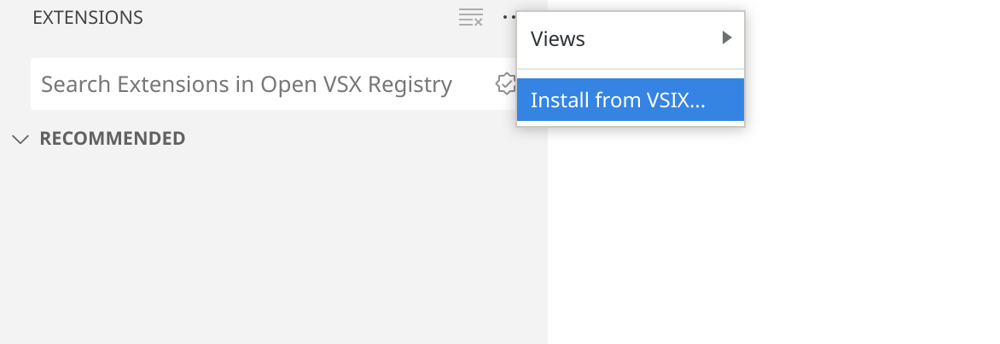

# Renode VSCode Extension

Copyright (c) 2024 [Antmicro](https://antmicro.com)

Renode Extensions for [Visual Studio Code](https://code.visualstudio.com/) and [Theia](https://theia-ide.org), allowing users to easily integrate with [Renode](https://renode.io), an open source simulation framework for embedded systems.

## Features

- Allows you to run your project in Renode and debug it in your editor.

- Provides web extension compatibility - lets you debug binaries even in a pure web editor (like vscode.dev).

## Requirements

You need to already have [Renode](https://github.com/renode/renode) and gdb, for architecture you're planning to debug, installed.

Additionally this extension requires [Renode WebSocket Proxy](https://github.com/antmicro/renode-ws-proxy), which manages your debug session and allows for remote connection.

## Building and installation

To build the extension, use `pnpm`:

```
pnpm i && pnpm run v:pack
```

This will produce a `renode*.vsix` file you can install in your IDE.

You can install it in the `Extension` tab, with the `Install from VSIX` option.



## Plugin configuration

Here is the sample configuration file you can place in `.vscode/launch.json` or `.theia/launch.json`:

```json
{
    "version": "0.2.0",
    "configurations": [
        {
            "type": "renodegdb",
            "request": "launch",
            "name": "Debug in Renode",
            "elf": "${workspaceFolder}/path/to/your/binary.elf"
            "gdb": "gdb-multiarch", /* provide the binary for GDB you would like to use */

            "resc": "${workspaceFolder}/your.resc",

            "cwd": "${workspaceFolder}",
            "terminals": [
                "ws://127.0.0.1:21234/telnet/29170", // Monitor
                "ws://127.0.0.1:21234/telnet/29171", // Log
                "ws://127.0.0.1:21234/telnet/29172"  // UART
            ],
        }
    ]
}

```

Please be advised that the `terminals` node is expected not to be needed in future.
